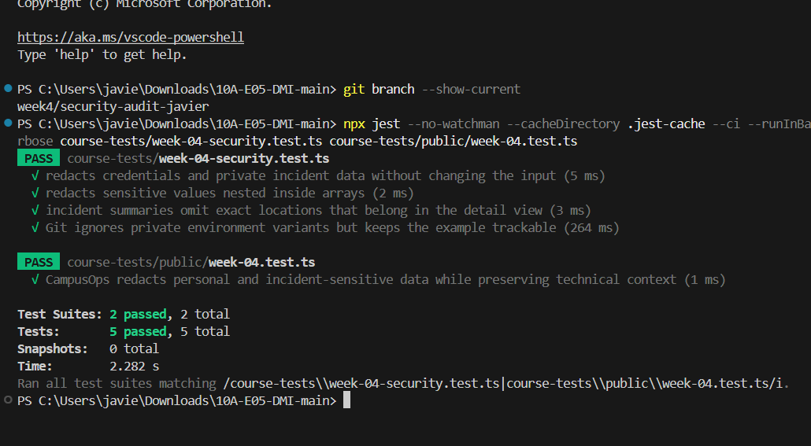
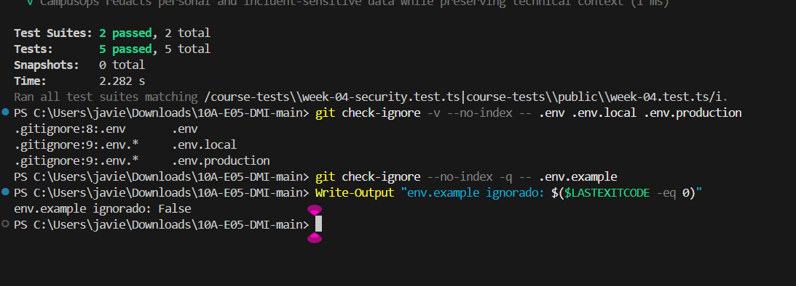
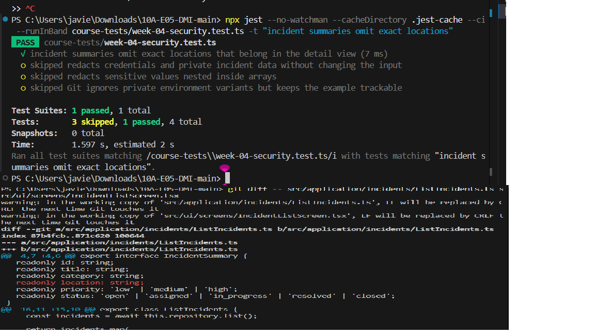
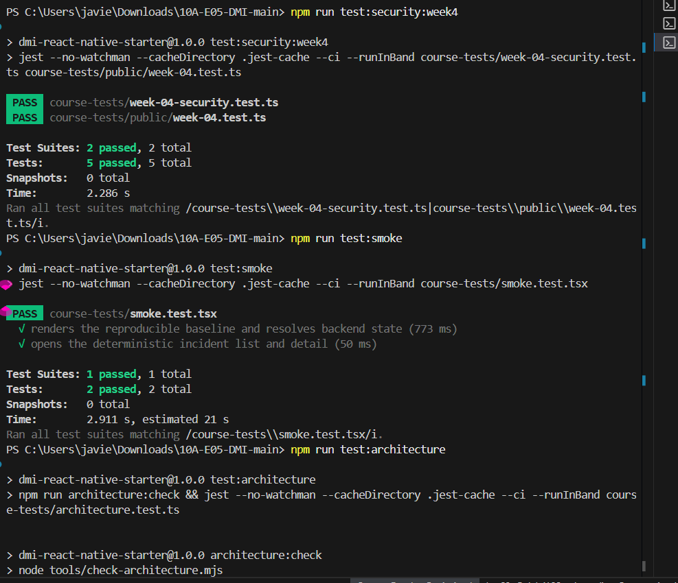

# Auditoría de seguridad y privacidad — Semana 4

- Proyecto: CampusOps
- Rama de trabajo: `week4/security-audit-javier`
- Fecha de revisión: 2026-09-24
- Alcance: telemetría, configuración local y minimización de datos en la lista de incidencias
- Datos utilizados: valores sintéticos y ubicaciones ficticias

## Hallazgos

| # | Hallazgo | Riesgo | Solución aplicada | Evidencia |
|---:|---|---|---|---|
| 1 | `redactForTelemetry` no tenía implementación | Una integración futura de telemetría no tendría un control común para ocultar credenciales, identidad, ubicación, fotografías o comentarios internos | Se agregó sanitización recursiva, normalización de nombres de campo y copia sin mutación | [Telemetría redactada](evidence/telemetria-redactada.png) |
| 2 | `.gitignore` sólo ignoraba el nombre exacto `.env` | Variantes habituales como `.env.local` o `.env.production` podían agregarse accidentalmente al repositorio | Se agregó `.env.*` y se conservó explícitamente `.env.example` | [Archivos de entorno ignorados](evidence/archivos-env-ignorados.png) |
| 3 | El resumen de incidencias incluía la ubicación exacta | La pantalla de consulta general exponía más información operativa de la necesaria | Se retiró `location` de `IncidentSummary` y de la tarjeta de lista; el detalle conserva el dato | [Minimización de ubicación](evidence/ubicacion-minimizada.png) |
| 4 | No existía un mecanismo persistente seguro para la futura sesión | Guardar tokens en preferencias, archivos o variables públicas expondría credenciales | Se agregó `SessionStorage` con un adaptador de `expo-secure-store` que falla sin degradarse a almacenamiento plano | `course-tests/week-04-session-storage.test.ts` |

## Hallazgo 1 — Telemetría sin sanitización implementada

### Problema encontrado

La función `redactForTelemetry`, ubicada en `src/course-evaluation/index.ts`, sólo llamaba a una función pendiente que lanzaba una excepción. El proyecto ya clasifica tokens, identidad, ubicación, fotografías y comentarios como información sensible, pero no existía el control ejecutable que prepara objetos seguros para telemetría.

### Riesgo

Si un objeto de solicitud, perfil o incidencia se enviara directamente a registros técnicos, una persona con acceso a esos registros podría consultar credenciales o datos privados. Los registros suelen conservarse y distribuirse más que la información original.

### Antes

```ts
export function redactForTelemetry(_input: unknown): unknown {
  return pending('redactForTelemetry');
}
```

### Después

La función recorre objetos y arreglos, normaliza claves y sustituye el valor completo de campos sensibles por `[REDACTED]`. Los campos técnicos permitidos, como `incidentId`, `correlationId`, `status`, `attempt` y `durationMs`, permanecen disponibles. La entrada no se modifica.

### Evidencia



La prueba pública y las pruebas negativas propias comprueban credenciales, identidad, ubicación, coordenadas, arreglos anidados e inmutabilidad.

## Hallazgo 2 — Variantes privadas de archivos de entorno no ignoradas

### Problema encontrado

El archivo `.gitignore` contenía únicamente esta regla:

```gitignore
.env
```

La comprobación inicial `git check-ignore -v -- .env.local` terminó sin coincidencia. Aunque no se encontró una credencial real, la configuración permitía agregar por error variantes comunes de archivos de entorno.

### Riesgo

Un archivo local o de producción puede contener URLs internas, identificadores o credenciales. Una vez confirmado, eliminarlo del directorio de trabajo no borra automáticamente el historial de Git.

### Después

```gitignore
.env
.env.*
!.env.example
```

`.env.example` permanece versionado y contiene solamente una URL local de demostración.

### Evidencia



## Hallazgo 3 — Ubicación exacta incluida en el resumen

### Problema encontrado

`ListIncidents` copiaba `location` a cada `IncidentSummary` y `IncidentListScreen` la mostraba en todas las tarjetas. La ubicación es un dato sensible según el modelo de amenazas del proyecto y no es necesaria para identificar una incidencia en la consulta general.

### Riesgo

Mostrar ubicaciones en una vista de alta densidad aumenta la exposición accidental y dificulta aplicar controles de acceso más específicos en etapas posteriores.

### Solución

El caso de uso ahora entrega únicamente identificador, título, categoría, prioridad y estado. La pantalla de detalle conserva la ubicación porque allí sí forma parte del contexto operativo.

### Evidencia



## Verificación final

| Comando | Resultado observado |
|---|---|
| `npm run typecheck` | PASS, sin errores de TypeScript |
| `npm run lint` | PASS, sin errores ni advertencias |
| `npm run test:security:week4` | PASS, 2 suites y 5 pruebas |
| `npm run test:smoke` | PASS, 1 suite y 2 pruebas |
| `npm run test:architecture` | PASS, 0 dependencias prohibidas y 2 pruebas |
| `git check-ignore` para `.env`, `.env.local` y `.env.production` | Los tres archivos privados coinciden con reglas de exclusión |



## Riesgo residual

- La sanitización usa una lista explícita que debe ampliarse cuando aparezcan nuevos campos sensibles.
- La aplicación móvil aún usa datos locales sintéticos y no implementa una sesión completa; autenticación, autorización y ciclo de tokens corresponden a hitos posteriores.
- La ubicación permanece en el detalle. El backend deberá autorizar cada consulta antes de usar información institucional real.
- El escaneo de secretos reduce errores conocidos, pero no sustituye la revisión humana ni la rotación de una credencial que haya sido expuesta.

## Comprobación de privacidad

No se utilizaron contraseñas, tokens, correos, ubicaciones o fotografías reales. Los valores incluidos en pruebas y evidencias son ficticios y desechables.
